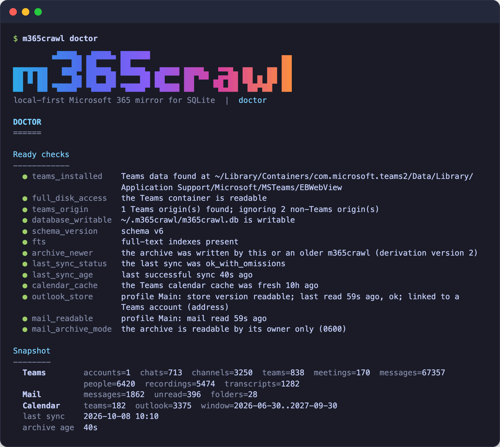

# teamscrawl 🟣 — Your Teams, readable by your agents.

[](https://github.com/ourostack/teamscrawl/actions/workflows/ci.yml)
[](https://github.com/ourostack/teamscrawl/releases)
[](https://go.dev/)
[](https://github.com/ourostack/teamscrawl/releases)
[](LICENSE)
[](https://github.com/ourostack/homebrew-tap)

`teamscrawl` mirrors the Microsoft Teams desktop app's local cache into a SQLite archive on your Mac, with full-text search, unread state, mentions and the activity feed, so an AI agent can read your Teams history in milliseconds, offline and read-only. It reads the local cache of the signed-in desktop app. It never talks to the Teams service, never reads your Teams credentials and never writes to Teams' storage.

<p align="center"></p>

## Why not a Teams MCP server or the Graph API?

- **No tokens, app registration or admin consent.** Graph needs an Entra app, delegated scopes and often a tenant admin to approve them. teamscrawl needs a signed-in Teams app and one macOS permission.
- **Built for agent context budgets.** Every item carries stable ids and a deep link; `--fields` and `--max-text` return only what you need, instead of full message payloads eating your context window.
- **No network, no rate limits.** A search over 50,000 messages returns in about 140 ms from local SQLite. No paging, no throttling, no round trips.
- **Works offline and under conditional access.** Device-compliance and location policies gate API tokens, not a file on your disk.
- **Read-only by construction.** There is no write path in the code. It cannot post, react or mark anything read, so handing it to an agent is safe.
- **Keeps what Teams evicts.** Teams trims its cache as it runs, and its cached message count can drop by thousands between two reads. The archive never deletes a message, so history survives as long as you sync regularly.
- **Full-text search and SQL over everything.** Messages, the activity feed, unread state and mentions sit in one database that an agent can query with FTS5 or plain SQL.

**When you want something else.** Use the Graph API or a Teams MCP server if you need to send or react, need data the desktop app never cached (old history you never scrolled to, other people's chats), run Teams on anything but macOS new Teams, or cannot grant Full Disk Access to your terminal or agent host.

## Install

Homebrew is the shortest path:

```sh
brew install ourostack/tap/teamscrawl
```

Release binaries are Developer ID signed and notarized by Apple only when the release was built with the Apple signing secrets; otherwise they are unsigned. The last line of each release's notes says which. The Homebrew cask clears the macOS quarantine flag either way. If you download a binary by hand and it is unsigned, run `xattr -dr com.apple.quarantine teamscrawl` once.

[GitHub Releases](https://github.com/ourostack/teamscrawl/releases) has `teamscrawl_<version>_darwin_arm64.tar.gz` and `teamscrawl_<version>_darwin_amd64.tar.gz` with a `checksums.txt`. To build from source, install Go 1.27 or newer:

```sh
go install github.com/ourostack/teamscrawl/cmd/teamscrawl@latest
```

### Grant Full Disk Access

macOS protects Teams' container, so the app that runs teamscrawl needs Full Disk Access: open System Settings > Privacy & Security > Full Disk Access, turn it on for your terminal (or the agent host app that launches teamscrawl), then quit and reopen that app. Verify with:

```sh
teamscrawl doctor
```

`doctor` checks every prerequisite and prints the exact app to grant when access is missing. It exits 3 if a required check fails.

## Quick start

The examples below run against the repository's committed test fixture, so every name and message is synthetic. To reproduce them from a clone, point teamscrawl at the fixture and a scratch archive:

```sh
export TEAMSCRAWL_TEAMS_ROOT="$PWD/testdata/teams-fixture/EBWebView"
export TEAMSCRAWL_DB="$(mktemp -d)/teamscrawl.db"
```

Against your own Teams, skip those two lines.

```sh
teamscrawl doctor
teamscrawl sync
teamscrawl search planning
teamscrawl unread --limit 5
teamscrawl activity --unread
teamscrawl thread 19:topicchannel1@thread.tacv2 1700000045000
```

Output is JSON when stdout is not a terminal and readable text on a terminal. Force either with `--format json|text`.

```sh
teamscrawl sync --json
```

```json
{"status":"ok","sources":[{"source":"WV2Profile_fixture|https_teams.microsoft.com_0","status":"ok","accounts":["00000000-0000-4000-8000-000000000001/00000000-0000-4000-8000-0000000000a1","00000000-0000-4000-8000-000000000002/00000000-0000-4000-8000-0000000000a2"],"counts":{"conversations":{"seen":14,"inserted":14,"updated":0,"unchanged":0},"messages":{"seen":104,"inserted":104,"updated":0,"unchanged":0},"people":{"seen":6,"inserted":6,"updated":0,"unchanged":0},"activity":{"seen":16,"inserted":16,"updated":0,"unchanged":0}}}],"conversations":{"seen":14,"inserted":14,"updated":0,"unchanged":0},"messages":{"seen":104,"inserted":104,"updated":0,"unchanged":0},"people":{"seen":6,"inserted":6,"updated":0,"unchanged":0},"activity":{"seen":16,"inserted":16,"updated":0,"unchanged":0},"omissions":{},"other_origins":[],"started_at":"2026-09-30T22:23:43.002609Z","finished_at":"2026-09-30T22:23:43.189474Z"}
```

```sh
teamscrawl search planning --limit 1
```

```json
{"items":[{"tenant_id":"00000000-0000-4000-8000-000000000001","user_id":"00000000-0000-4000-8000-0000000000a1","conversation_id":"19:planningchannel1@thread.tacv2","conversation_display_name":"Fixture team 1 › Planning","id":"1700000047000","reply_chain_id":"1700000047000","parent_message_id":"1700000047000","sender_id":"8:orgid:00000000-0000-4000-8000-0000000000ee","sender_name":"Pat Example","sent_at":"2023-11-14T22:14:07Z","message_type":"RichText/Html","text":"Planning channel message","mentions_me":false,"importance":"normal","pinned":false,"link":"https://teams.microsoft.com/l/message/19:planningchannel1@thread.tacv2/1700000047000?tenantId=00000000-0000-4000-8000-000000000001&context=%7B%22contextType%22%3A%22channel%22%7D"}],"count":1,"truncated":false,"archive_age_seconds":8}
```

```sh
teamscrawl activity --unread --limit 1 --fields at,type,conversation_display_name,text
```

```json
{"items":[{"at":"2023-11-14T22:22:00Z","type":"follow","conversation_display_name":"Fixture team 2 › Planning","text":"Planning channel message"}],"count":1,"truncated":true,"archive_age_seconds":0}
```

To stream changes as Teams writes them, run `watch`. It prints JSON Lines (one object per line, the one exception to the one-document rule): a `message` or `activity` line per change, then a `sync` line per sync. The first sync is a silent baseline, so only later changes appear; `--emit-initial` prints that one too, as here:

```sh
teamscrawl watch --emit-initial --fields id,type,text,sender_name --max-text 30
```

```json
{"kind":"message","change":"new","item":{"id":"1700000001000","text":"Hello from Alex Fixture","sender_name":"Alex Fixture"}}
{"kind":"activity","change":"new","item":{"id":"fixture-activity-1-1","type":"mentionInChat","text":"Alex Fixture and Sam Tag see t…","sender_name":"Pat Example","text_truncated":true}}
{"kind":"sync","report":{"status":"ok","sources":[{"source":"WV2Profile_fixture|https_teams.microsoft.com_0","status":"ok","accounts":["00000000-0000-4000-8000-000000000001/00000000-0000-4000-8000-0000000000a1","00000000-0000-4000-8000-000000000002/00000000-0000-4000-8000-0000000000a2"],"counts":{"conversations":{"seen":14,"inserted":14,"updated":0,"unchanged":0},"messages":{"seen":104,"inserted":104,"updated":0,"unchanged":0},"people":{"seen":6,"inserted":6,"updated":0,"unchanged":0},"activity":{"seen":16,"inserted":16,"updated":0,"unchanged":0}}}],"conversations":{"seen":14,"inserted":14,"updated":0,"unchanged":0},"messages":{"seen":104,"inserted":104,"updated":0,"unchanged":0},"people":{"seen":6,"inserted":6,"updated":0,"unchanged":0},"activity":{"seen":16,"inserted":16,"updated":0,"unchanged":0},"omissions":{},"other_origins":[],"started_at":"2026-10-01T20:07:12.88674Z","finished_at":"2026-10-01T20:07:13.109182Z"}}
```

Run it in the background and read its stdout; Ctrl-C (or SIGTERM) stops it with exit 0. A change reaches the output after Teams flushes it to its cache plus a few seconds of debounce; measured against a real cache that was about 12 to 32 seconds from the moment a message was sent.

`--account <tenantId>/<userId>` limits any command to one signed-in account; `teamscrawl whoami` lists them. The archive lives at `~/.teamscrawl/teamscrawl.db` (override with `--db` or `TEAMSCRAWL_DB`).

## For agents

Agents should read [`.agents/skills/teamscrawl/SKILL.md`](.agents/skills/teamscrawl/SKILL.md), or run `teamscrawl skill` to print the same guide from the installed binary. It holds the workflow, every command, every error code and what to do about each. The full normative contract is [`SPEC.md`](SPEC.md). The contract in five bullets:

- Results go to stdout, progress and warnings to stderr. In JSON mode each command prints exactly one document.
- Lists are `{"items": [...], "count": N, "truncated": bool}` with `--limit` (default 50); a truncated list also has `"total": N`, the exact match count. Keys are snake_case and stable; new fields may appear, renames are breaking changes.
- Errors are `{"error": {"code", "message", "fix"}}` on stderr, and `fix` is an instruction you can follow. Exit codes: 0 success, 1 runtime failure, 2 usage, 3 environment not ready, 4 another run holds the lock.
- Every item carries a `link` (a Teams deep link) for citing, and every read result carries `archive_age_seconds`, counted from the last fully successful sync of the accounts the read covers (a partial or failed sync refreshes nobody).
- Nothing ever writes to Teams.

Flags that matter for agents:

- `--max-age 15m` (or `TEAMSCRAWL_MAX_AGE`) makes a read command run a sync first when the last successful one is older. `0` disables it. When a read does sync first it prints one line on stderr beforehand (plain text in text mode, `{"notice":"syncing","reason":"stale",...}` as JSON otherwise) and the result gains `synced: {seconds, status}`. If the implicit sync fails, the command still answers from the archive, warns on stderr and adds a `sync_error` field.
- `--fields a,b,c` keeps only those top-level keys of each item.
- `--max-text N` truncates each item's text to N characters, including the trailing `…` (it may cut mid-word), and sets `text_truncated`.
- `archive_age_seconds` tells you how stale the answer can be. An archive with no complete sync yet (never synced, only partial or failed syncs, or written by an older teamscrawl) adds `"needs_sync":true` and `"hint":"run teamscrawl sync"` to every read result.
- System pseudo-conversations (`48:notifications`, `48:calllogs`, `48:annotations`) are hidden by default because they duplicate real messages; `--include-system` brings them back. An @-mention shows in `text` as the person's plain name, `mentions` lists who was mentioned and `mentions_me` is exact and `mention_kind` (`person`, `channel`, `team`, `tag`, `everyone`) says how you were mentioned; `--direct-mentions` keeps only `person` mentions. Bot cards, call events and thread events read as plain text (`Call ended · 23m`), never raw JSON.

## Commands

| Command | What it does |
| --- | --- |
| `doctor` | Checks Teams, Full Disk Access, origins, the archive and the last sync. Exits 3 on a blocking failure. |
| `whoami` | Lists the accounts in the archive and the archive's state. |
| `sync` | Copies the Teams cache into the archive once and prints what changed. The first sync after an upgrade first re-derives older rows' text and names from their stored `raw_json` (report field `migrated`, counted as no update). Each Teams source commits on its own: if one fails and another succeeds the status is `partial`, the report is on stdout, a `partial_sync` error is on stderr and the exit status is 1. |
| `status` | Shows archive counts per account, the last sync and other Teams origins seen. |
| `search [query]` | Full-text search over message text, newest first. The query is optional when a filter is given. Filters: `--conversation`, `--team`, `--from`, `--since`, `--until`, `--mentions-me`, `--direct-mentions`, `--include-deleted`, `--include-system`. |
| `messages` | Lists messages chronologically (oldest first). Same filters as `search`, plus `--unread` and `--include-channels`. Channel thread roots carry `reply_count` and `last_reply_at`. |
| `unread` | Lists unread messages in chats and meetings, newest first. Flags: `--team`, `--since` (count only recent unread messages; use it for "what needs my attention"), `--include-channels` (channels are off by default because their unread counts are noise; results then carry `"channels_excluded":true`), `--by-conversation` (one item per conversation with its unread count, most unread first), `--include-system`. |
| `activity` | Lists activity-feed items (mentions, replies, reactions) joined with their messages. Filters: `--unread`, `--type` (comma separated; `mention` and `mentionInChat` are different types), `--direct-mentions`, `--team`, `--since`, `--include-system`. Items carry `actor_id` and `actor_name`: who reacted, replied or mentioned (a reaction's actor is inferred, `actor_inferred: true`). |
| `thread <conversation> <root-id>` | Shows one thread. Accepts a Teams message link instead of the two arguments, and `--limit` (default 50, check `truncated`). |
| `conversations` | Lists conversations, sorted by last activity, newest first (default `--limit 50`, check `truncated`). Filters: `--kind`, `--query` (best match first: exact name, then prefix, then substring), `--team`, `--include-system`. Untitled group chats are named after their members (`Ana, Ben, Chao +2`). |
| `teams` | Lists teams with `channel_count`, `last_activity_at` and `unread_count`; a team's `team_id` or `display_name` is what `--team` takes. |
| `people` | Lists people seen as senders or members; use it to resolve `--from`. |
| `sql <query>` | Runs one read-only SELECT against the archive. |
| `watch` | Runs until interrupted and streams one JSON line per new, edited or deleted message or activity item as Teams writes its cache, plus one `{"kind":"sync","report":{...}}` line per sync, and one `{"kind":"migrated","from":1,"to":2,"rows":N}` line when an upgrade re-derives an older archive (not a change: no `edited` lines). Flags: `--every` (poll interval, default `60s`), `--emit-initial`; honors `--account`, `--fields` and `--max-text`; system pseudo-conversations (48:notifications, 48:calllogs, 48:annotations) are skipped. |
| `skill` | Prints the agent guide (the same text as `.agents/skills/teamscrawl/SKILL.md`, embedded in the binary) as raw Markdown in every output mode, so an agent can read the guide that matches the installed version. |
| `version` | Prints `{"version","commit","date"}` (one JSON document; a human line in text mode). `teamscrawl --version` does the same. |

Every command takes the global flags `--format`, `--json`, `--db`, `--teams-root`, `--account`, `--no-color`, `--max-age`, `--fields` and `--max-text`. Run `teamscrawl <command> --help` for the rest.

Text output is colored on a terminal. `--no-color` or `NO_COLOR` turns color off; `CLICOLOR_FORCE=1` turns it on when output is piped (this is how `make screenshot` renders `screenshot.png`). JSON output is never colored and never changes with any of these.

## Documentation

- [`SPEC.md`](SPEC.md): the normative specification (data model, sync, output contract, every error code, `watch`, privacy, known limits).
- [`docs/commands.md`](docs/commands.md): every command and flag, as `--help` prints them.
- [`docs/how-it-works.md`](docs/how-it-works.md): from the Teams cache to a SQLite row (LevelDB, IndexedDB, the Blink envelope, V8, the allowlist, full-text search).
- [`docs/full-disk-access.md`](docs/full-disk-access.md): why macOS asks, how to grant it, how `doctor` checks it.
- [`CHANGELOG.md`](CHANGELOG.md) and [`docs/releases/`](docs/releases/): what changed in each release.
- [`AGENTS.md`](AGENTS.md): development rules for agents working on this repository.

## How it works

1. **Snapshot.** teamscrawl copies the new Teams app's IndexedDB (Chromium LevelDB plus blob files) into a private 0700 temp directory, retrying if Teams writes mid-copy. The copy contains Teams' sign-in database, so it is removed on every exit path, including failure and Ctrl-C.
2. **Decode.** A built-in reader parses LevelDB, Chromium's IndexedDB coding and V8's structured-clone format. No Node, Python or browser is needed at runtime.
3. **Allowlist.** Only the conversation, reply-chain (message) and activity-feed stores are decoded. Everything else, including sign-in data, is listed by name and never read.
4. **Store.** Rows go into SQLite (WAL) with FTS5 indexes, using idempotent upserts. A second sync with no new Teams activity changes nothing. Messages that vanish from Teams' cache stay in the archive; Teams deletions set `deleted_at`.

Full Disk Access is the only permission it asks for ([why and how](docs/full-disk-access.md)). If the cache fingerprint has not changed since the last sync, `sync` skips decoding.

## Privacy

The archive holds your real Teams conversations. It stays on your Mac in `~/.teamscrawl/` (directory 0700, database 0600) and teamscrawl has no network code. Treat the database like the chats it contains: do not commit it, sync it to shared storage or paste it into tools you would not show the original messages to. Tests and this README use only synthetic fixture data.

## Limits

- It sees only what the desktop app has cached. History you never scrolled to may be missing, and Teams evicts old messages from its cache, so sync regularly.
- macOS and the new Teams app (`com.microsoft.teams2`) only. Classic Teams, Windows and Linux are not supported.
- Full Disk Access is required for the app that runs it.
- Read-only: no sending, reacting or marking read.
- Attachments and media are not downloaded; files and links are recorded as metadata.
- Teams can change its storage layout. When it does, `sync` fails with a named error or reports counted omissions instead of guessing.
- Release binaries are signed and notarized only when the release had signing credentials; the release notes say which.

## Development

```sh
make build      # bin/teamscrawl
make test       # unit tests with the race detector
make e2e        # end-to-end tests against the committed fixture
make coverage   # 100% function coverage gate on internal/...
make check      # every gate CI runs: tidy, fmt, vet, lint, test, coverage, e2e
```

The integration tests run against `testdata/teams-fixture/`, an IndexedDB cache written by a real Microsoft Edge through `scripts/fixture/`. Regenerate it with `make fixture` (needs Node and Edge) and V8 test vectors with `make v8vectors` (needs Node 22). Real-cache acceptance (`TEAMSCRAWL_REAL_CACHE=1 make acceptance`, needs Full Disk Access, Node 22 and python3) runs locally only; its results are recorded as counts and pass/fail, never content. See [`AGENTS.md`](AGENTS.md) for the development rules.

## Credits

- [slacrawl](https://github.com/openclaw/slacrawl) (openclaw, MIT) is the model for this tool's design and commands, and the source of the terminal renderer.
- [ccl_chromium_reader](https://github.com/cclgroupltd/ccl_chromium_reader) (MIT) documented the Chromium IndexedDB and V8 formats and served as the reference decoder.

## License

MIT. See [LICENSE](LICENSE).
